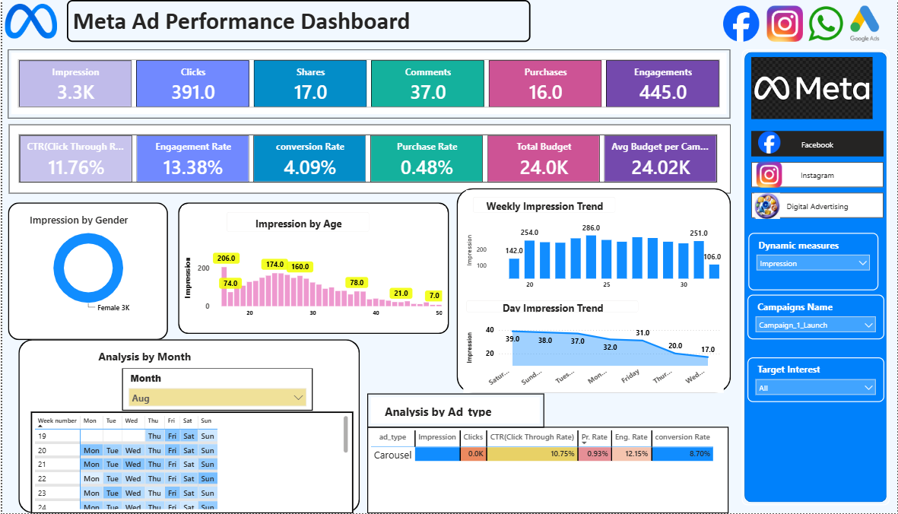

# 📊 Meta Ad Performance Dashboard

An interactive **Power BI** dashboard that analyzes advertising performance across **Facebook** and **Instagram** campaigns. It tracks reach, engagement, conversions and budget in one place.

---

## 🎯 Project Objective
To help marketing teams understand how their Meta ad campaigns perform and which audiences, ad types and time periods deliver the best results.

---

## 🖼️ Dashboard Preview

### Facebook Page


### Instagram Page


---

## 📈 Key Metrics

| Metric | Description |
|---|---|
| Impressions | Number of times ads were shown |
| Clicks | Total ad clicks |
| Shares / Comments | Social interactions |
| Purchases | Conversions from ads |
| Engagements | Total user interactions |
| CTR | Click-Through Rate (Clicks ÷ Impressions) |
| Engagement Rate | Engagements ÷ Impressions |
| Conversion Rate | Purchases ÷ Clicks |
| Purchase Rate | Purchases ÷ Impressions |
| Total Budget | Total campaign spend |

### Snapshot
| Platform | Impressions | Clicks | CTR | Engagement Rate |
|---|---|---|---|---|
| Facebook | 3.3K | 391 | 11.76% | 13.38% |
| Instagram | 1.7K | 187 | 10.88% | 12.10% |

---

## 🔍 Dashboard Features
- Separate pages for **Facebook**, **Instagram** and **Digital Advertising**
- Impressions by **gender** and **age**
- **Weekly** and **daily** impression trends
- **Monthly calendar** view
- **Ad type** analysis (Carousel, Stories)
- Slicers: **Campaign Name**, **Target Interest**, **Month**
- **Dynamic measure** selector to switch the metric shown

---

## 🛠️ Tools Used
- Power BI Desktop
- DAX (measures and KPIs)
- Power Query (data cleaning)

---

## 📁 Project Structure
```
├── dashboard/   → Power BI file (.pbix)
├── images/      → Dashboard screenshots
├── data/        → Data notes (optional)
└── README.md
```

---

## ▶️ How to Use
1. Download `dashboard/meta_ad_performance_dashboard.pbix`
2. Open it in **Power BI Desktop** (free to download from Microsoft)
3. Use the slicers on the right to filter by campaign, interest and month

---

## 💡 Key Insights
- Facebook delivered more impressions and clicks than Instagram.
- Instagram had a higher conversion rate (9.09% vs 4.09%).
- Engagement is strongest among users aged roughly 20 to 30.

---

## 👤 Author
**Nishant Pal**
